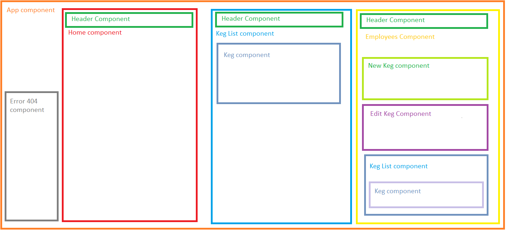

## _React Tap Room_

### _***Kevin Garvey***_

### _Description:_
##### _A website for a bar which includes a list of all beers on tap, infomation about the bar itself, and employee functions such as the ability to sell drinks and add new kegs to the tap list. 07/5/2019_

### _Specs_
|Component|Concern|
|---|---|
|App|Entry point for application|Homepage|Displays an inital splash page to the user|
|Header|Provide user with navigation links|
|Keg|Defines the attributes of all kegs|
|KegList|Display a list of all kegs. Includes buttons allowing employees to sell pints, edit keg info, and replace kegs.|EditKegForm|Allow employees to update keg infomation|
|NewKegForm|Allow employees to add new kegs to the list|
|AboutUs|Provides additional images and information about the bar.| 

  

### _Setup/Installation_

- _Clone the React-Tap-Room directory from https://github.com/kmgarvey279/React-Tap-Room._
- _Navigate to the cloned folder and run `npm install` in the command line._
- _Run `npm start` to start host the site at `http://localhost:8080`_

### _Support and contact details_

_Please contact me at kmgarvey279@gmail.com if you have any questions or comments._

### _Technologies Used_
_- ES6 - JSX - React - Lint - Webpack -_  

_This software is licensed under the MIT license._